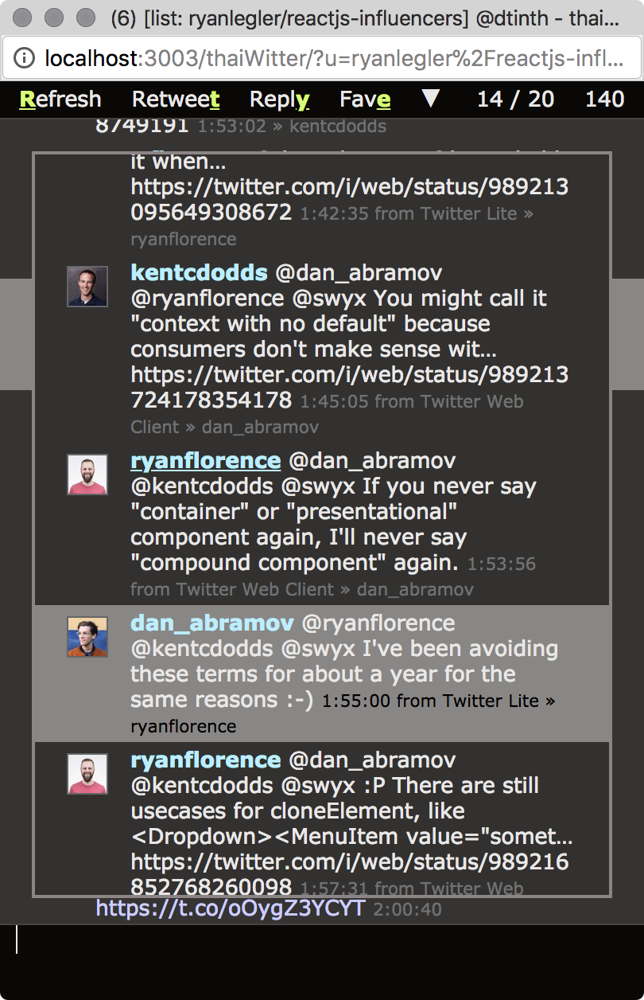
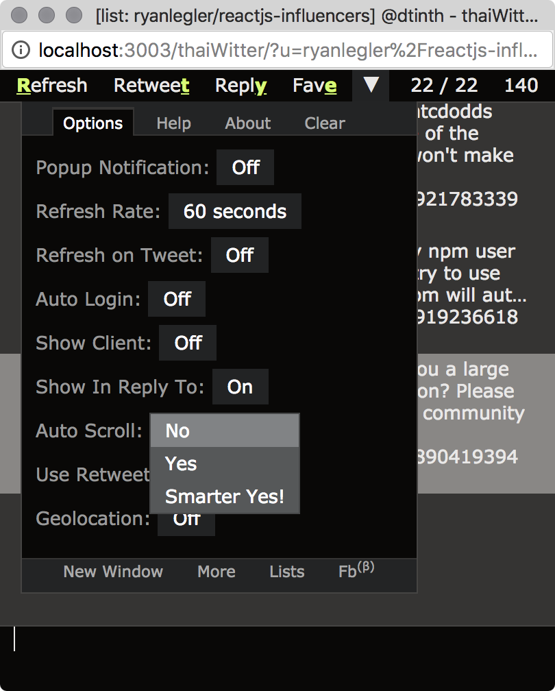
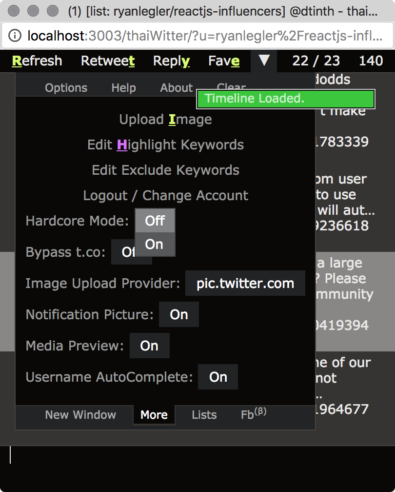
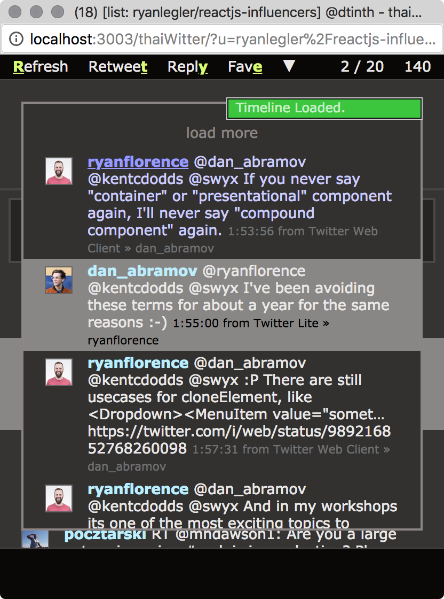
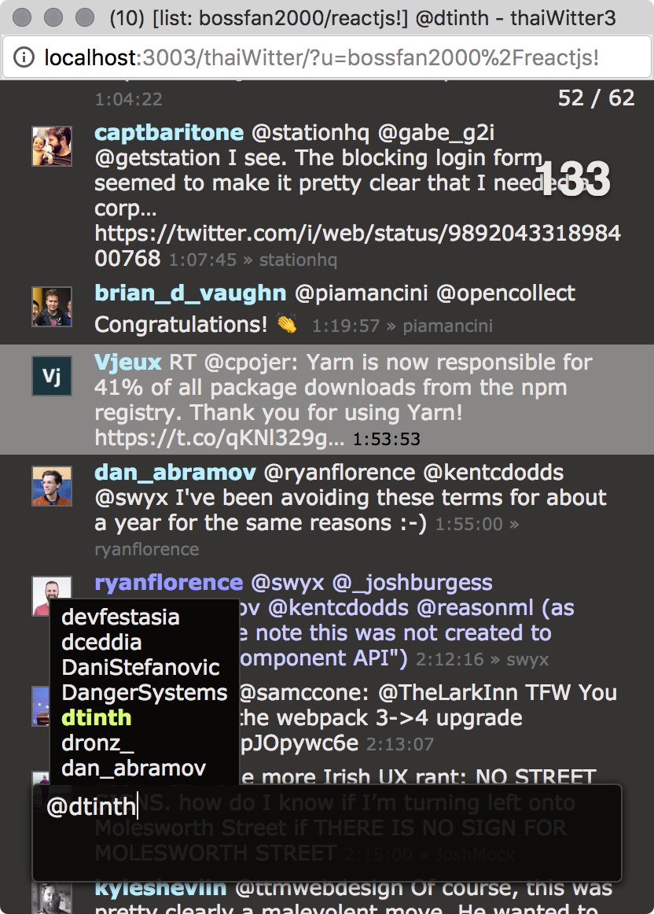

thaiWitter
==========

**thaiWitter** is a web-based Twitter client that I have written back in 2009, when I was 16 years old. It is one of my first project of considerable size (codebase is more than 7000 lines).

But back at that time I lacked software engineering skills. I just threw a bunch of things I learned into this project. So, the project becomes less maintainable, and eventually, I stopped maintaining it in 2013.

Nevertheless, it’s still up running on Heroku to this day! In fact, I still use it occasionally. If you want to try it: https://tw3.herokuapp.com/

Now, in 2018, I am open-sourcing this project for posterity. I don’t have a plan to update it further yet, but feel free to fork this project!

## Features

- **Super smooth!** A lot of animation in this app. The aim is to create a Twitter client with a fast and responsive UI. It runs at 45fps in Firefox 3. It has a [custom scrolling equation](http://me.dt.in.th/page/thaiWitterScrollingEquation) to ensure the smoothest timeline scrolling experience!

<p align="center">
  
</p>

- **Simple dark theme.** Designed for readability, I used a simple dark theme with a font that’s optimized for easy reading on screen (Verdana).

- **Natural reading flow.** When you read books, you read from top-to-bottom. thaiWitter puts newer tweets at the bottom too, so you can follow the flow of the conversation in a natural way.

- **Keyboard based.** You can tweet, favorite, reply, retweet, view threads, view images, and so on... all using keyboard.

- **Desktop notifications.** Get notified even when you’re working on something else. Doesn’t work anymore because it relies on the old `webkitNotifications` API from 2010.

- **Show Client** — See who uses what to post to Twitter.

- **Auto Scrolling** — Auto scroll to the bottommost tweet when loaded.

<p align="center">
  
  
</p>

- **Image Preview** — View images in tweets without leaving thaiWitter.

- **View Conversation** — Press <kbd>Shift+Enter</kbd> on a tweet to view a conversation.

- **User/List Timeline** — Press <kbd>Ctrl+U</kbd> and type in the `username` or `username/list-slug` to view it.

- **List Updates Timeline** — Press <kbd>Ctrl+U</kbd> and type in the `username/list-slug!` to view only the latest tweet of each member in the list, sorted chronologically. Very useful if you have a list of your friends and want to see what they up to after you haven’t used Twitter for a while.

<p align="center">
  
  
</p>

- **Keyword Highlight** — You can put in a list of keywords, and they will be highlighted in blue.

- **Mention Highlight** — Tweets that mention your name will be highlighted in red.

- **Hardcode Mode** — Removes the top bar and tweet input area at the bottom (you have to remember the keyboard shortcut). Start typing to activate the tweet input box.

- **Username Autocomplete** — Completes the user name as you type.

- **Custom CSS** — Allows you to put your own CSS to customize the UI.

## Tech stuff

You are looking at a code that’s more than 5 years old...

### Client

- **No 3rd party frontend framework.** I manage all DOM elements manually, but this gave me complete control of DOM animations, which allowed me to optimize the performance as I wish. (Back at that time, it’s very hard to create smooth animations. CSS transitions and animations didn’t exist back then.)

- **3rd party front-end libraries:**

    - [q](https://www.npmjs.com/package/q), a promise library.

    - [underscore](https://www.npmjs.com/package/underscore).

- **Self-written front-end libraries:**

    - [DtJS 2](./client/lib/dtjs2.js), a rewrite of [DtJS](https://github.com/dtinth/DtJS), my web animation framework and utility functions for front-end programming in 2009 era. Provides change observer, DOM node generator, animation system, DOM utilities (element/scrolling/viewport size/position queries, events), AJAX, JSONP, and color manipulation.

    - [twcs](./client/lib/twcs.js), thaiWitter Class System.

    - [T.js](./client/T), my utility library, provides function generators, JSON parser, change observer, digit padder, date formatter/parser, and tweet parser.

- **Frontend code is written in a custom compile-to-JS language**, thaiJS, which adds classes (transpiles to twcs), [method binding](https://github.com/tc39/proposal-bind-operator), [protected and private fields](https://github.com/tc39/proposal-private-fields) to JavaScript. [The compiler](./lib/thaijs/lib/thaiJS.coffee) is written in CoffeeScript and is 260 lines long.

- **No automated tests.** This is one of the big reason I cannot keep maintaining this. As I add more feature and code gets more complex, I become less confident in changing code.

- **Lots of monkeypatching.** To avoid changing old code, I try to adopt an approach where I don’t have to modify old code, but writing new code to patch old code at runtime. I thought it would be great. As it turned out, it leads to even harder maintenance.

### Server

- **Node.js based.**

- **Development server** with server module reloading on each refresh (no need to restart the server. Just save and refresh like PHP).

- **Self-written asset pipeline.** On development, compile on the fly. On production, compile and save in memory, so that the whole app can be served without disk I/O.

## Setup

### Install dependencies

```
npm install
```

### Create an application on Twitter

1. Go here &rarr; https://apps.twitter.com/app/new
    - **Name:** thaiWitter-OSS
    - **Description:** Open source version of thaiWitter
    - **Website:** https://github.com/dtinth/thaiWitter3
    - **Callback URL:** http://localhost:3003/thaiWitter/api/callback

2. Go to **Settings** tab and uncheck **Callback Locking**.

3. Go to **Keys and Access Token** tab.

4. Copy the **Consumer Key** and **Consumer Secret**.

### Configure server environment

Create file `.env` with content:

```
THAIWITTER_CONSUMER_KEY=
THAIWITTER_CONSUMER_SECRET=
```

Put in the value from previous step.

### Run server

```
node server.js
```

### Enter app

http://localhost:3003/

## License

MIT, unless stated otherwise
